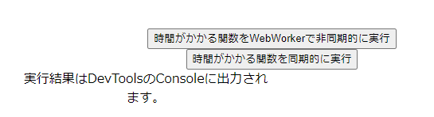

# React（Vite環境）でWeb Workerを導入する手順

## はじめに
create-react-appでは、Web Workerを導入するのが困難(※1)でした。

Viteの場合はどうやるか？気になったので調べてみると、
Web Workerの読み込みをサポートしているので、簡単に実現できました。


※1. できないことはないですが、トリッキーな方法でしか実現できませんでした
* publicフォルダにWorkerのJSファイルを配置して読み込む(TypeScriptで書けない)
* ejectしてからWebPackの設定に worker-loader または worker-plugin を追加する
* react-app-rewired を使ってWebPackの設定を無理やり書き換える
* WorkerのJSファイルをBlobとして読み込んでからWorkerスレッドを生成する

参考：
[create-react-app(TypeScript)で作成したアプリにWeb Workerを導入する方法](https://qiita.com/murasuke/items/897faa6b2e6e071bbcd0)


### [サンプルプログラム](https://murasuke.github.io/react_vite_web_worker/)
  


作成したソースはこちら
https://github.com/murasuke/react_vite_web_worker

GitHub Pagesのページ
https://murasuke.github.io/react_vite_web_worker/


## 作成手順

### プロジェクト作成
* viteでReactプロジェクトを作成

```bash
$ npm create vite@latest react_vite_web_worker  -- --template react-ts
$ cd react_vite_web_worker
$ code .
```

### Web Workerを作成

* Web Workerでイベントを受信後、2秒したら完了を返すテスト処理

```typescript:./src/worker.ts
self.addEventListener('message', (e) => {
  console.log('Web Workerで受信');
  console.log(e);
  setTimeout(() => {
    // 2秒後に処理終了
    self.postMessage('Web Workerで処理完了');
  }, 2000);
});

export default {};
```


### ReactからWeb Workerを呼び出す

* Reactコンポーネントの`useEffect()`でWeb Workerを読み込む
* ボタンクリックでWeb Workerの処理を呼び出す
* Web Workerの処理終了後、`onmessage`イベントで結果を受け取る

```typescript:./src/database.ts
import { useEffect, useRef } from 'react';
import './App.css';

function App() {
  const workerRef = useRef<Worker | null>(null);
  useEffect(() => {
    // workerを読み込む
    workerRef.current = new Worker(new URL('./worker', import.meta.url), {
      type: 'module',
    });

    // 処理結果を受信する
    workerRef.current.onmessage = (event) => {
      const data = event.data;
      console.log('メインスレッドで受信:', data);
    };

    return () => {
      workerRef.current?.terminate();
    };
  }, []);

  // Web Workerに処理を依頼する
  const handleClick = () => {
    if (workerRef.current) {
      console.log('メインスレッドで送信');
      workerRef.current.postMessage('開始');
    }
  };

  return (
    <div>
      <button id="exec" onClick={() => handleClick()}>
        Web Workerで処理実行
      </button>
      <p>実行結果はDevToolsのConsoleに出力されます。</p>
    </div>
  );
}

export default App;

```

* 下記のように読み込むこともできるようです

[スクリプトを Worker としてインポートする](https://ja.vitejs.dev/guide/assets.html#%E3%82%B9%E3%82%AF%E3%83%AA%E3%83%95%E3%82%9A%E3%83%88%E3%82%92-worker-%E3%81%A8%E3%81%97%E3%81%A6%E3%82%A4%E3%83%B3%E3%83%9B%E3%82%9A%E3%83%BC%E3%83%88%E3%81%99%E3%82%8B)

```typescript:
import { useEffect, useRef } from 'react';
import Worker from './worker?worker'; // ?workerをつける
import './App.css';

function App() {
  const workerRef = useRef<Worker | null>(null);
  useEffect(() => {
    // workerを読み込む
    workerRef.current = new Worker();
    // ～～ 以下省略 ～～
```

## 動作確認

```bash
$ npm run dev

  VITE v5.1.5  ready in 191 ms

  ➜  Local:   http://localhost:5173/
  ➜  Network: use --host to expose
  ➜  press h + enter to show help
```


* コンソールを開いてから、ボタンをクリックすると各処理の流れを追うことができます
  * App.tsxからの呼び出し
  * Web Workerで実行
  * 2秒後にApp.tsxで処理結果の受け取り

  


## おまけ GitHub Pagesにデプロイ

### `vite.config.ts` に`base:`を追加

`react_vite_web_worker` の部分は、リポジトリ名です

```javascript:vite.config.ts
export default defineConfig({
  base: process.env.GITHUB_PAGES ? 'react_vite_web_worker' : './',
```

### `package.json` の`build'を変更

* `dist`を`docs`にコピー

```json:package.json
    "build": "tsc && vite build && cp -r dist docs",
```


### GitHub Pagesで公開するための設定

* ①`Setting` ⇒ ②`Pages` をクリック
* ③公開するブランチ(main or master)と、公開するディレクトリ`docs`を選択して`Save`をクリック


### ビルドとデプロイ

* ビルドの際`docs`ディレクトリが作成されることを確認（公開用）
```bash
$ npm run build
```

* デプロイ

コミットしてから、通常通りpushを行う

```bash
$ git push
```


### GitHub Pagesで公開されたことを確認

数分待ってから`https://murasuke.github.io/react_vite_web_worker/`へアクセスすると、GitHub Pagesで公開されたことが確認できる


